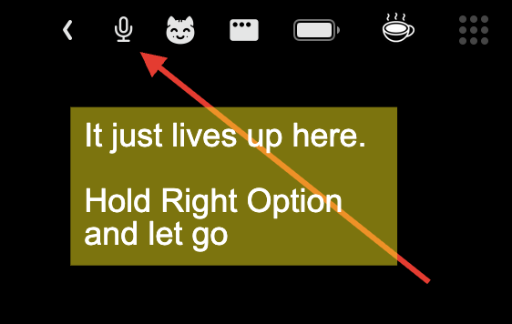

# OpenWispr for macOS


A native macOS menu bar dictation app inspired by the [OpenWispr GNOME flow](../gnome).



## What it does

- Menu bar mic app with `idle -> recording -> processing` states
- Global hotkeys for toggle recording and hold-to-talk
- STT providers:
  - Local `whisper-cli`
  - OpenAI endpoint
  - Groq endpoint
  - OpenRouter Parakeet
- Optional LLM transcript cleanup (OpenAI, Groq, or OpenRouter)
- Optional FFmpeg silence trimming
- Clipboard copy always + optional auto-paste (`Cmd+V` simulation)
- Optional clipboard restore after auto-paste
- Optional start-at-login toggle (when running as a bundled `.app`)

## Failed recordings and retries

Temporary network failures and retryable server errors get up to three transcription
attempts, with 1- and 3-second delays. Each network request is limited to 30 seconds;
the full processing cycle (including trimming and optional cleanup) is limited to 90 seconds.
Cancel stops processing and preserves the audio.

Failed or canceled recordings survive app restarts in
`~/Library/Application Support/OpenWispr/PendingRecordings`. The menu shows the number
of saved recordings. **Retry** processes the oldest using current settings and copies
the result without auto-pasting; **Discard** deletes the oldest. New dictation keeps
previously saved recordings. Audio is deleted after successful transcription or discard.

## Dependencies (Homebrew)

```bash
brew install ffmpeg whisper-cpp
```

Expected default paths:

- `ffmpeg`: `/opt/homebrew/bin/ffmpeg` (Apple Silicon)
- `whisper-cli`: `/opt/homebrew/bin/whisper-cli` (Apple Silicon)

If your binaries are elsewhere, set paths in app Settings.

## Run

```bash
swift run OpenWispr
```

When running via `swift run`, macOS notifications are disabled automatically because this runtime is not a bundled `.app`.

## Permissions

For full behavior parity, macOS may prompt for:

- Microphone access
- Accessibility access (for synthetic paste)

Start at login requires running the packaged `.app` (not `swift run`).

## Local model

For local STT, point `Local Model Path` to a valid Whisper model file, for example:

`~/openwispr/models/ggml-base.en.bin`

## Provider onboarding

On a fresh install, **Set up OpenWispr** opens a native window. It explains audio and
cleanup destinations, connects your provider (Groq recommended), checks Microphone
and Accessibility, captures toggle/hold shortcuts, and runs a real test dictation.
The test displays text in setup only: it never pastes or changes your clipboard.
Keep the default models; provider keys, endpoints, and local paths use existing Settings.

Use **Back** or **Finish later** anytime. Progress and completion are saved; reopen
setup from the menu or Settings. Existing configured users are not shown setup
automatically, and no settings are reset. Accessibility is optional when automatic
paste is off. Key creation and system privacy settings have direct links. Close setup
to resume everyday recording shortcuts; use the buttons for the safe test.

Failed test audio is separate from saved everyday dictations. **Retry test** uses
current settings; **Discard test audio** deletes only that test. Leaving while
recording stops without uploading; already-running processing may finish in setup.
Test audio and text are session-only: successful test audio is deleted, and any
remaining test audio is removed on a normal quit. Everyday failure recovery still
survives restarts as described above.

See the shared [provider guide](../../docs/providers.md) for models and privacy behavior.

## Notes

- This is a standalone macOS app codebase (not a GNOME extension port-in-place).
- API keys are currently stored in user defaults for speed of iteration.

## Packaging

Create an unsigned drag-and-drop `.dmg` locally:

```bash
./scripts/package-release.sh v0.1.0
```

Artifacts are written to `dist/`:

- `OpenWispr-<tag>-macos-<arch>.dmg`
- `OpenWispr-<tag>-macos-<arch>.dmg.sha256`

The app icon is generated from `openwispr.png` during packaging.

This package is intentionally unsigned for now.

## GitHub Releases

Pushing any git tag triggers `.github/workflows/release.yml`, which will:

- build the release package
- upload it as a workflow artifact
- create/update a GitHub Release for that tag with the dmg + checksum attached

## Tests and Linting

```bash
./scripts/lint.sh
./scripts/test.sh
./scripts/check.sh
```

- `scripts/lint.sh`: strict style checks using `swift format lint`.
- `scripts/test.sh`: self-test executable for shortcut parsing, response parsing, and path resolution.
- `scripts/check.sh`: lint + build + self tests + Swift Testing in one command.
- `swift test --filter "setup|captur"`: focused setup progress, shortcut capture, safe test-result, cancellation, and audio isolation tests.
